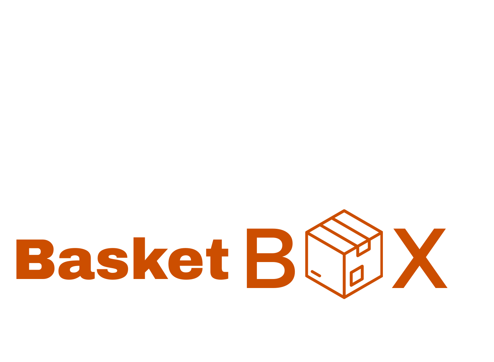
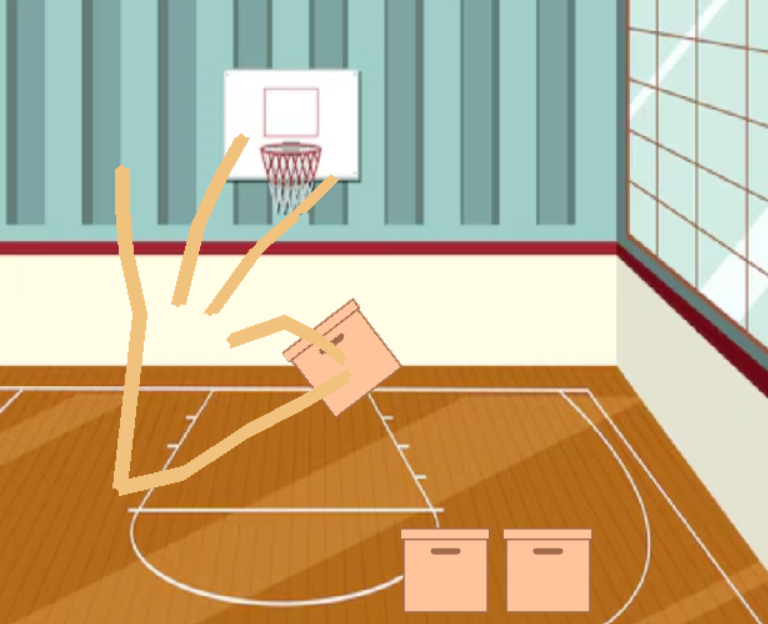

# BasketBox



BasketBox is an interactive AI-powered basketball box simulation using Python, Pygame, Pymunk, OpenCV, and MediaPipe. Control virtual boxes with your hand gestures detected by your webcam!

---

## Features
- Real-time hand tracking and gesture recognition
- Physics-based box movement
- Interactive basketball court background
- Splash screen before starting
- Easy-to-use controls

---

## Requirements
- **Python version:** 3.11.x (recommended)
- **Operating System:** Windows (tested), compatible with other OS with minor changes

### Python Packages
- pygame
- pymunk
- mediapipe
- opencv-python



---

## Installation

1. **Clone the repository:**
   ```powershell
   git clone <repo-url>
   cd BasketBox
   ```

2. **(Optional) Create a virtual environment:**
   ```powershell
   python -m venv venv
   venv\Scripts\activate
   ```

3. **Install dependencies:**
   ```powershell
   pip install -r requirements.txt
   ```
   If you don't have a `requirements.txt`, install manually:
   ```powershell
   pip install pygame pymunk mediapipe opencv-python
   ```

4. **Add images:**
   Place the following images in the `images/` folder:
   - `logoWhite.png` (logo)
   - `splash.png` (splash screen)
   - `caja.png` (box)
   - `basketball.png`, `cesped.png` (optional backgrounds)

---

## How to Run

1. **From the project root, run:**
   ```powershell
   python -m src.BasketBox.main
   ```
   Or, if you have a main script:
   ```powershell
   python juego.py
   ```

2. **Controls:**
   - Press <kbd>SPACE</kbd> to start from splash screen
   - Use your hand to interact with boxes (make a fist to grab)
   - Press <kbd>ESC</kbd> or close window to exit

---

## Project Structure
```
BasketBox/
│   README.md
│   requirements.txt
│   pyproject.toml
│   setup.cfg
│
├── images/
│     logoWhite.png
│     splash.png
│     caja.png
│     cancha.png
│     basketball.png
│     cesped.png
│
└── src/
      BasketBox/
         __init__.py
         main.py
         ...
```

---

## Professional Notes
- Code is modular and commented in English
- Uses constants for hand connections for clarity
- Splash screen and logo for professional look
- All dependencies listed for reproducibility
- Compatible with Python 3.11.x

---

## Author
Developed by Víctor Rodríguez Dorta

---

Enjoy BasketBox! 🏀
